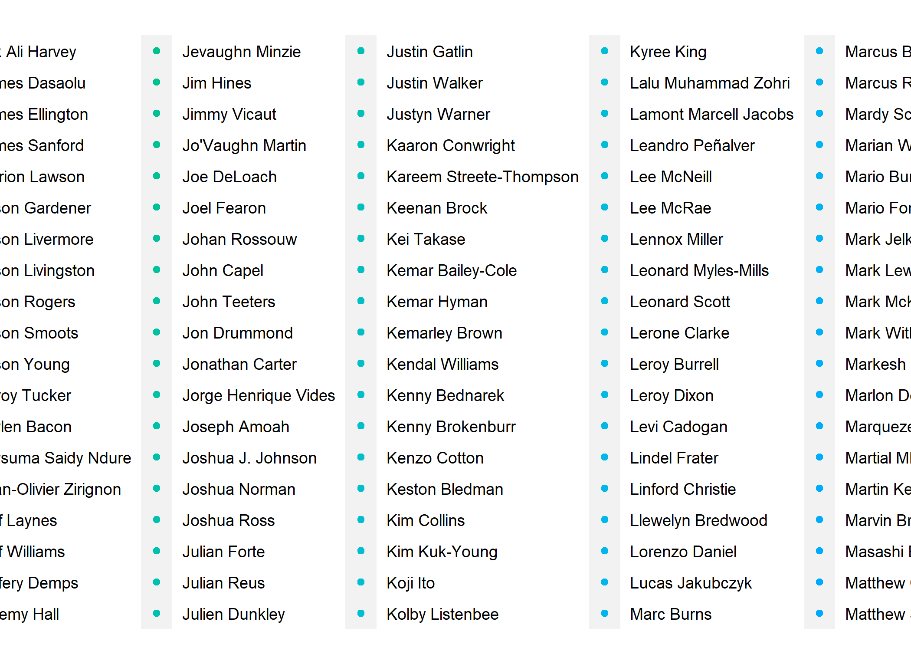
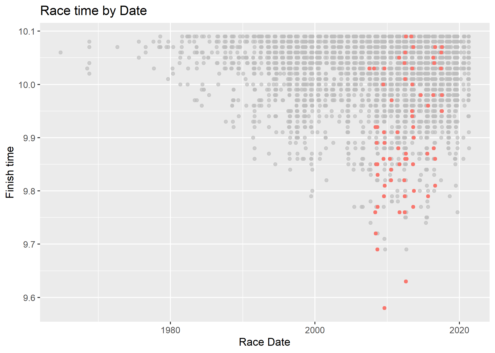
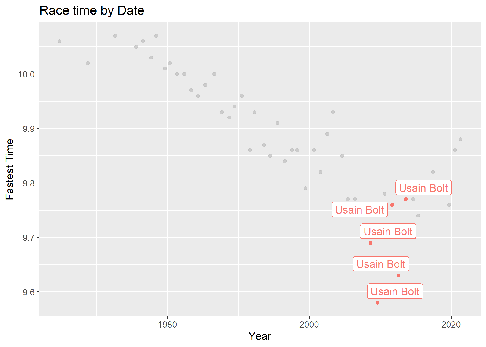
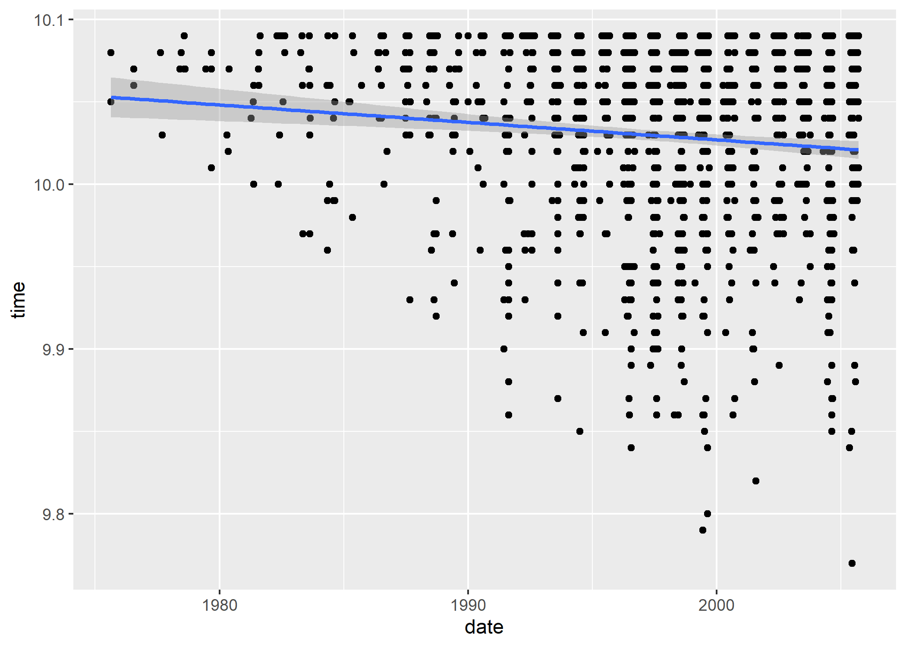

## Background

In class, we practiced webscraping with the Wikipedia page on the [Men's 100 metres world record progression](http://en.wikipedia.org/wiki/Men%27s_100_metres_world_record_progression). For this assignment, we're going to continue with a similar theme, except we won't only be limiting ourselves to world record times. The page that we're scraping will also have a few complications that require extra (or at least different) steps.

Here is the webpage: **[All-time men's best 100m](http://www.alltime-athletics.com/m_100ok.htm)**.

*<b>Note:</b> You are welcome to use the [women's all-time best 100m times](http://www.alltime-athletics.com/w_100ok.htm) if you prefer. However, please be aware that you may (will?) have to adjust some of the specific hints below. It will be become more obvious why once we get to the prediction section of the assignment.*

Now is good time to load any packages that you will be needing, as well as set your preferred plotting theme, etc. 
## Loading Packages

```r
## Load your packages here, e.g.
if (!require("pacman")) install.packages("pacman")
```

```
## Warning: package 'pacman' was built under R version 4.0.5
```

```r
pacman::p_load(lubridate, janitor, rvest, jsonlite, fredr, listviewer, usethis, sf, tidyverse, data.table, hrbrthemes, lwgeom, rnaturalearth, maps, mapdata, spData, tigris, tidycensus, leaflet, mapview, tmap, tmaptools, xml2, gghighlight, sjPlot, sjmisc, sjlabelled)
```

```
## Warning: unable to access index for repository http://www.stats.ox.ac.uk/pub/RWin/bin/windows/contrib/4.0:
##   cannot open URL 'http://www.stats.ox.ac.uk/pub/RWin/bin/windows/contrib/4.0/PACKAGES'
```

```
## package 'sjPlot' successfully unpacked and MD5 sums checked
## 
## The downloaded binary packages are in
## 	C:\Users\cyrus\AppData\Local\Temp\RtmpqA49Sa\downloaded_packages
```

```
## Warning: package 'sjPlot' was built under R version 4.0.5
```

```
## Warning in pacman::p_load(lubridate, janitor, rvest, jsonlite, fredr, listviewer, : Failed to install/load:
## sjPlot
```


## Things to check

```r
# 2.2 I'm not sure if he wants us to exclude spaces or not. I can't figure out how to exclude spaces if so yet. Maybe the string/grep presenter can help? :)
# 3.2 What does the hint "Look for an athlete that has the first name "Kareem" for an illustration of what might go wrong." point us to? 
# Make a header row for variable names for m100
#
#
#3.4 i'm not sure if im supposed to convert rank to something. some values are weird like 1rA and 2r3 
```


## 1) Read in the data

Take a look at the [webpage](http://www.alltime-athletics.com/m_100ok.htm) in your browser. We only want the information contained in the main table at the top (i.e. ignore the rolling starts, manual timing, etc.) Read this table into R and call the resulting object `m100_wp`.

*Hint: In class, we practiced identifying the correct HMTL elements with CSS selectors and SelectorGadget. However, you will almost certainly find it easier / more precise to scrape the table in this example via its XPath. Use your browser's "Inspect" functionality to find and copy over this XPath. Remember to specify the "xpath" argument (instead of the default "css") when pulling this information into R, i.e. `rvest::html_element(xpath = "XPATH_HERE")`.*


## Load Data

```r
base_url = read_html("http://www.alltime-athletics.com/m_100ok.htm")


m100_wp =
  base_url %>%
  html_element(xpath = "/html/body/center[3]/pre")
```

## 2) Parse into an R object


### 2.1) Try parsing with `rvest::html_table()`

```r
html_table(m100_wp) #doesn't run unfortunately 
```

```
## Error in matrix(unlist(values), ncol = width, byrow = TRUE): 'data' must be of a vector type, was 'NULL'
```

With the Wikipedia example from class, we were able to parse an HTML table into a data frame simply by using `rvest::html_table()`. What happens if you try that here?

**We are not able to simply convert this object into a html table because we have one very long string that cannot be put into a neat and tidy table. The Xpath we read everything as is a very long string unlike the Wikipedia table**

### 2.2. Try parsing with `rvest::html_text()`
Unfortunately, the HTML object that we've read into R is old-school text. Luckily, we can still extract this text pretty easily into an R string. Do that and name the resulting object `m100_text`. Show me the first 1000 characters.
*Hint: The `head()` function works by elements, not characters. So you'll need some other function to show the first 1000 characters.*
## Parsing object into text

```r
m100_wp = html_text(m100_wp) #If not running input must me a vector. Run line ~58 first. 
```

### First 1000 Characters

```r
first_1000_characters = substr(m100_wp, start = 1, stop = 1000)  
  

#typeof(m100_wp)

## I'm not sure if he wants us to exclude spaces or not. I can't figure out how to exclude spaces if so yet. 
first_1000_characters 
```

```
## [1] "\n        1      9.58       +0.9    Usain Bolt                     JAM     21.08.86    1      Berlin                        16.08.2009\n        2      9.63       +1.5    Usain Bolt                     JAM     21.08.86    1      London                        05.08.2012\n        3      9.69       ±0.0    Usain Bolt                     JAM     21.08.86    1      Beijing                       16.08.2008\n        3      9.69       +2.0    Tyson Gay                      USA     09.08.82    1      Shanghai                      20.09.2009\n        3      9.69       -0.1    Yohan Blake                    JAM     26.12.89    1      Lausanne                      23.08.2012\n        6      9.71       +0.9    Tyson Gay                      USA     09.08.82    2      Berlin                        16.08.2009\n        7      9.72       +1.7    Usain Bolt                     JAM     21.08.86    1rA    New York City                 31.05.2008\n        7      9.72       +0.2    Asafa Powell                   JAM"
```


## 3) Convert to a data frame

### 3.1 ) Read as data frame

```r
#m100 = read_fwf(m100_wp, skip = 1, n_max = 3436)
m100 = read_table(m100_wp, col_names = FALSE, col_types = NULL, locale = default_locale(),
  na = "NA",
  skip = 1,
  n_max = 3436,
  progress = show_progress(),
  comment = "",
  skip_empty_rows = TRUE)
  
head(m100)
```

```
## # A tibble: 6 x 9
##      X1 X2    X3    X4          X5    X6       X7    X8       X9        
##   <dbl> <chr> <chr> <chr>       <chr> <chr>    <chr> <chr>    <chr>     
## 1     1 9.58  +0.9  Usain Bolt  JAM   21.08.86 1     Berlin   16.08.2009
## 2     2 9.63  +1.5  Usain Bolt  JAM   21.08.86 1     London   05.08.2012
## 3     3 9.69  ±0.0  Usain Bolt  JAM   21.08.86 1     Beijing  16.08.2008
## 4     3 9.69  +2.0  Tyson Gay   USA   09.08.82 1     Shanghai 20.09.2009
## 5     3 9.69  -0.1  Yohan Blake JAM   26.12.89 1     Lausanne 23.08.2012
## 6     6 9.71  +0.9  Tyson Gay   USA   09.08.82 2     Berlin   16.08.2009
```

At this point, we basically have one loooong string that we need to convert to a data frame. Please do this and assign the resulting object as `m100`. Don't worry about specifying column names yet.

*Hint: You have two (related) options here: Convert either based on whitespace separation of columns, or fixed-width file format.  The `readr` package provides methods for reading both whitespace-separated columns and fixed-width files. See the [reference guide](https://readr.tidyverse.org/reference/index.html#section-read-rectangular-files) guide for more details. If you opt for the latter, please pay particular attention to the option of guessing the fixed column positions based on the the position of empty columns, as well as how many rows are parsed by default to determine the data frame shape. See the Details and Examples sections of the relevant help documentation.*


### 3.2) Inspect and fix (if needed)

```r
head(m100, 9)
```

```
## # A tibble: 9 x 9
##      X1 X2    X3    X4           X5    X6       X7    X8            X9        
##   <dbl> <chr> <chr> <chr>        <chr> <chr>    <chr> <chr>         <chr>     
## 1     1 9.58  +0.9  Usain Bolt   JAM   21.08.86 1     Berlin        16.08.2009
## 2     2 9.63  +1.5  Usain Bolt   JAM   21.08.86 1     London        05.08.2012
## 3     3 9.69  ±0.0  Usain Bolt   JAM   21.08.86 1     Beijing       16.08.2008
## 4     3 9.69  +2.0  Tyson Gay    USA   09.08.82 1     Shanghai      20.09.2009
## 5     3 9.69  -0.1  Yohan Blake  JAM   26.12.89 1     Lausanne      23.08.2012
## 6     6 9.71  +0.9  Tyson Gay    USA   09.08.82 2     Berlin        16.08.2009
## 7     7 9.72  +1.7  Usain Bolt   JAM   21.08.86 1rA   New York City 31.05.2008
## 8     7 9.72  +0.2  Asafa Powell JAM   23.11.82 1rA   Lausanne      02.09.2008
## 9     9 9.74  +1.7  Asafa Powell JAM   23.11.82 1h2   Rieti         09.09.2007
```

```r
tail(m100, 5)
```

```
## # A tibble: 5 x 9
##      X1 X2    X3    X4              X5    X6       X7    X8         X9        
##   <dbl> <chr> <chr> <chr>           <chr> <chr>    <chr> <chr>      <chr>     
## 1   308 10.09 +0.7  Yoshihide Kiryu JPN   15.12.95 1h3   Tokyo      23.08.2020
## 2   308 10.09 +0.9  Jeffery Demps   USA   08.01.90 1r1   Des Moines 29.08.2020
## 3   308 10.09 +0.3  Filippo Tortu   ITA   15.06.98 3     Roma       17.09.2020
## 4   308 10.09 +1.9  Marvin Bracy    USA   15.12.93 6rA   Miramar    10.04.2021
## 5   308 10.09 +0.4  Rohan Browning  AUS   31.12.97 1     Sydney     17.04.2021
```

```r
summary(m100)
```

```
##        X1             X2                 X3                 X4           
##  Min.   :  1.0   Length:3436        Length:3436        Length:3436       
##  1st Qu.:161.0   Class :character   Class :character   Class :character  
##  Median :246.0   Mode  :character   Mode  :character   Mode  :character  
##  Mean   :284.1                                                           
##  3rd Qu.:308.0                                                           
##  Max.   :876.0                                                           
##       X5                 X6                 X7                 X8           
##  Length:3436        Length:3436        Length:3436        Length:3436       
##  Class :character   Class :character   Class :character   Class :character  
##  Mode  :character   Mode  :character   Mode  :character   Mode  :character  
##                                                                             
##                                                                             
##                                                                             
##       X9           
##  Length:3436       
##  Class :character  
##  Mode  :character  
##                    
##                    
## 
```


What does your resulting `m100` data frame look like? Print the first and last few rows to screen so that I can see it too.

Depending on the functions and arguments that you used in the previous question, you may need to do some additional work to fix the resulting data frame, For example, you should only have 9 columns. If that isn't the case, inspect your dataset and figure out where the problem lies. Fix this issue as best you can, so that you only have nine columns.

*Hint: Look for an athlete that has the first name "Kareem" for an illustration of what might go wrong.*

**My dataset has 9 columns/variables so there is no issue with that. I haven't added column names yet so it has "Usain Bolt" where "athlete" should be and it has his impossible Personal Record 9.58 Seconds where we should have the label "time" etc...**


### 3.3) Assign column names

You should now (hopefully) have nine columns. Assign them the following names: `c("rank", "time", "windspeed", "athlete", "country", "dob", "race_rank", "location", "date")`.


```r
colnames(m100)<-c("rank", "time", "windspeed", "athlete", "country", "dob", "race_rank", "location", "date") #This replaced the first row

head(m100)
```

```
## # A tibble: 6 x 9
##    rank time  windspeed athlete     country dob     race_rank location date     
##   <dbl> <chr> <chr>     <chr>       <chr>   <chr>   <chr>     <chr>    <chr>    
## 1     1 9.58  +0.9      Usain Bolt  JAM     21.08.~ 1         Berlin   16.08.20~
## 2     2 9.63  +1.5      Usain Bolt  JAM     21.08.~ 1         London   05.08.20~
## 3     3 9.69  ±0.0      Usain Bolt  JAM     21.08.~ 1         Beijing  16.08.20~
## 4     3 9.69  +2.0      Tyson Gay   USA     09.08.~ 1         Shanghai 20.09.20~
## 5     3 9.69  -0.1      Yohan Blake JAM     26.12.~ 1         Lausanne 23.08.20~
## 6     6 9.71  +0.9      Tyson Gay   USA     09.08.~ 2         Berlin   16.08.20~
```


### 3.4 Convert columns to correct classes

Finally, convert your columns to the correct classes. Date columns should be converted to dates, numeric columns should be converted to numeric, etc.


```r
sapply(m100, class)
```

```
##        rank        time   windspeed     athlete     country         dob 
##   "numeric" "character" "character" "character" "character" "character" 
##   race_rank    location        date 
## "character" "character" "character"
```


```r
m100$date <- dmy(m100$date)

#also need to convert dob
m100$dob <- dmy(m100$dob)

sapply(m100, class) #confirm that we successfully converted to class: Date
```

```
##        rank        time   windspeed     athlete     country         dob 
##   "numeric" "character" "character" "character" "character"      "Date" 
##   race_rank    location        date 
## "character" "character"      "Date"
```

```r
head(m100) #dates are now year-month-day
```

```
## # A tibble: 6 x 9
##    rank time  windspeed athlete country dob        race_rank location date      
##   <dbl> <chr> <chr>     <chr>   <chr>   <date>     <chr>     <chr>    <date>    
## 1     1 9.58  +0.9      Usain ~ JAM     1986-08-21 1         Berlin   2009-08-16
## 2     2 9.63  +1.5      Usain ~ JAM     1986-08-21 1         London   2012-08-05
## 3     3 9.69  ±0.0      Usain ~ JAM     1986-08-21 1         Beijing  2008-08-16
## 4     3 9.69  +2.0      Tyson ~ USA     1982-08-09 1         Shanghai 2009-09-20
## 5     3 9.69  -0.1      Yohan ~ JAM     1989-12-26 1         Lausanne 2012-08-23
## 6     6 9.71  +0.9      Tyson ~ USA     1982-08-09 2         Berlin   2009-08-16
```


```r
m100$time <- as.numeric(m100$time)
```

```
## Warning: NAs introduced by coercion
```

```r
m100$windspeed <- as.numeric(m100$windspeed)
```

```
## Warning: NAs introduced by coercion
```

```r
sapply(m100, class) #confirm that we successfully converted to class: numeric
```

```
##        rank        time   windspeed     athlete     country         dob 
##   "numeric"   "numeric"   "numeric" "character" "character"      "Date" 
##   race_rank    location        date 
## "character" "character"      "Date"
```

```r
head(m100) 
```

```
## # A tibble: 6 x 9
##    rank  time windspeed athlete country dob        race_rank location date      
##   <dbl> <dbl>     <dbl> <chr>   <chr>   <date>     <chr>     <chr>    <date>    
## 1     1  9.58       0.9 Usain ~ JAM     1986-08-21 1         Berlin   2009-08-16
## 2     2  9.63       1.5 Usain ~ JAM     1986-08-21 1         London   2012-08-05
## 3     3  9.69      NA   Usain ~ JAM     1986-08-21 1         Beijing  2008-08-16
## 4     3  9.69       2   Tyson ~ USA     1982-08-09 1         Shanghai 2009-09-20
## 5     3  9.69      -0.1 Yohan ~ JAM     1989-12-26 1         Lausanne 2012-08-23
## 6     6  9.71       0.9 Tyson ~ USA     1982-08-09 2         Berlin   2009-08-16
```


## 4) Plot the data

Plot the data, with the race date on the x-axis and time on the y-axis. Highlight Usain Bolt's times in red.


```r
plot1 <- ggplot(m100, aes(x = date, y = time, color = athlete)) + geom_point() + labs(title="Race time by Date", x = "Race Date", y = "Finish time")

plot1
```

```
## Warning: Removed 24 rows containing missing values (geom_point).
```

<!-- -->

```r
# library(gghighlight) #already loaded

plot1 + gghighlight(athlete == "Usain Bolt") # I get message: "Too many data points, skip labeling"
```

```
## Warning: Tried to calculate with group_by(), but the calculation failed.
## Falling back to ungrouped filter operation...
```

```
## label_key: athlete
```

```
## Too many data points, skip labeling
```

```
## Warning: Removed 24 rows containing missing values (geom_point).
```

<!-- -->

```r
#ggplot(m100) + aes(x = date, y = time, color = athlete) + geom_point() + labs(title="Race time by Date", x = "Race Date", y = "Finish time") + gghighlight(athlete == "Usain Bolt")
```


## 5) Subset to fastest times per year

It's hard to fit a sensible model to the above data. What might make more sense is to think of 100 metre times as following some kind of (approximately) deterministic process over the years. Subset the data to the fastest time recorded in each year. Call this new data frame `m100_yr` and then repeat the plot above, again highlighting Usain Bolt's times.


```r
m100_fastest <- m100 %>% 
  group_by(date) 
#Extract Year from the Date-Time Column
m100_fastest$year <- year(m100_fastest$date)
#now we have the year for each time
m100_fastest2 <- m100_fastest %>% 
    group_by(year) %>% 
    slice(which.min(time))

   

ggplot(m100_fastest2) + aes(x = date, y = time, color = athlete) + geom_point() + labs(title="Race time by Date", x = "Year", y = "Fastest Time") + gghighlight(athlete == "Usain Bolt")
```

```
## Warning: Tried to calculate with group_by(), but the calculation failed.
## Falling back to ungrouped filter operation...
```

```
## label_key: athlete
```

<!-- -->

```r
#Because we lost the first row we do not have the fastest time of all time set by Usain Bolt
```


## 6) Modeling and prediction

Imagine that you are back in the year **2005**. You are tasked with fitting a model of year-best 100m times up until that point. Importantly, your model will also be used to predict the trajectory of future 100m times.

### 6.1) Fit a model

Start by fitting a simple regression model of your choice, using data that would have been available to you then (you can include 2005). You are free to use whatever specification you prefer, but please be explicit by writing the model down. (Use dollar signs to demarcate LaTeX equations in R Markdown.) Please also show me the actual regression results in a nicely-formatted table.

*Hint: I'd advise excluding data from before 1975, since we don't have consecutive or consistent records before then.*


```r
post74pre05_m100 =
  m100 %>%
  filter(date > "1975-01-01", date < "2006-01-01")

reg = lm(time ~ date, data = post74pre05_m100)

plot6 =
  ggplot(data = post74pre05_m100, aes(x= date, y = time)) +
  geom_point() +
  geom_smooth(method = lm) +
  theme_gray()


summary(reg)  
```

```
## 
## Call:
## lm(formula = time ~ date, data = post74pre05_m100)
## 
## Residuals:
##      Min       1Q   Median       3Q      Max 
## -0.25125 -0.02963  0.01562  0.04209  0.06903 
## 
## Coefficients:
##               Estimate Std. Error  t value Pr(>|t|)    
## (Intercept)  1.006e+01  7.625e-03 1319.201  < 2e-16 ***
## date        -2.905e-06  7.416e-07   -3.917 9.45e-05 ***
## ---
## Signif. codes:  0 '***' 0.001 '**' 0.01 '*' 0.05 '.' 0.1 ' ' 1
## 
## Residual standard error: 0.05604 on 1222 degrees of freedom
##   (11 observations deleted due to missingness)
## Multiple R-squared:  0.0124,	Adjusted R-squared:  0.01159 
## F-statistic: 15.35 on 1 and 1222 DF,  p-value: 9.448e-05
```

```r
plot6
```

```
## `geom_smooth()` using formula 'y ~ x'
```

```
## Warning: Removed 11 rows containing non-finite values (stat_smooth).
```

```
## Warning: Removed 11 rows containing missing values (geom_point).
```

<!-- -->

```r
#tab_model(reg) Not sure how nice of a table he wants for our regression 
```

$\hat{Y} = \hat{\beta_0} + \hat{\beta_1}x_1 + \epsilon$  
$Time_i = \beta_0 + \hat{\beta_1}Date_i + \epsilon$  
$\beta_0 = 1.006*10^{1}$ and $\beta_1 = -2.905*10^{-6}$  

### 6.2) Prediction


Fast forward to the present day. Given your model and the available data in 2005, what year would you have predicted humanity reaching the current world record time of 9.58 seconds? How does this compare with the year that Usain Bolt actually set it (i.e. 2009). What do you make of this?


### 6.3) Plot your results

Provide a visual depiction of your prediction model. I basically want you to repeat your earlier plot from Question 4, but now with a (95 percent) prediction envelope. The prediction envelope should extend through both the "fitted" (<= 2005) _and_ "predicted" (2006--present) data periods. Make sure that these two periods are clearly demarcated in your plot.

*Hint: geom_smooth() isn't going to help you here because you need to predict out of sample.*


## 7) Map

### 7.1 Static map

Finally, go back to your original `m100` data frame, which contains all the data (i.e. not just the fastest time in each year). I want you to give me a sense of athletic achievement by country (including duplicate observations for the same athlete). Plot a world map, with a colour fill proportional to the number of fastest times that have been contributed by athletes of each country.

*Hint: Use the `sf`-compatible "countries" data frame from the `rnaturalearth` package that I showed you in the spatial lecture. This will come with a column of "iso_a3" country codes that you can match (i.e. join) to the "country" column of the `m100` data frame. There will likely be some mismatches because of inconsistencies in the ISO codes across these data frames. I won't be too strict about this, though you may find the `countrycode::countrycode()` function a helpful alternative.*


### 7.2. Interactive map

A major downside of the above static map is that some powerhouses of world athletics are geographically tiny nations in the Caribbean, which are very hard to see. One way to overcome this is to plot an interactive map using **leaflet** or one of the derivative packages that we discussed in the spatial lecture.
