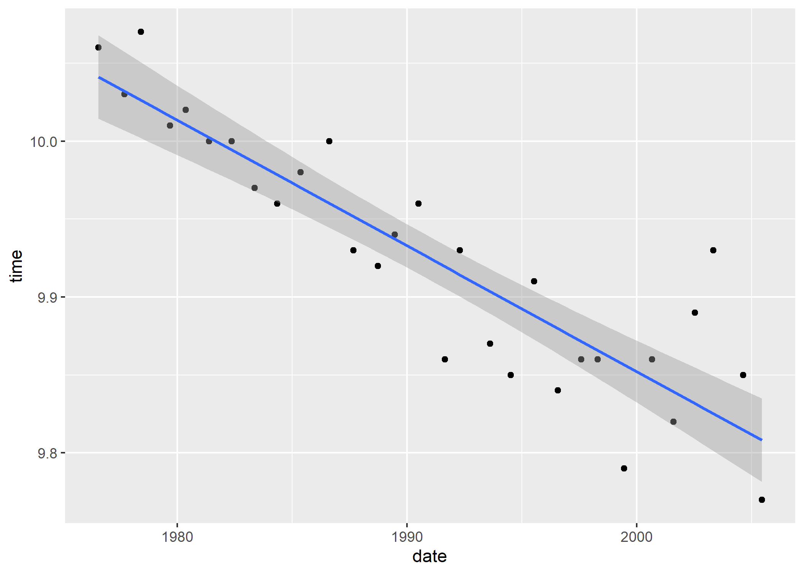

## Background

In class, we practiced webscraping with the Wikipedia page on the [Men's 100 metres world record progression](http://en.wikipedia.org/wiki/Men%27s_100_metres_world_record_progression). For this assignment, we're going to continue with a similar theme, except we won't only be limiting ourselves to world record times. The page that we're scraping will also have a few complications that require extra (or at least different) steps.

Here is the webpage: **[All-time men's best 100m](http://www.alltime-athletics.com/m_100ok.htm)**.

*<b>Note:</b> You are welcome to use the [women's all-time best 100m times](http://www.alltime-athletics.com/w_100ok.htm) if you prefer. However, please be aware that you may (will?) have to adjust some of the specific hints below. It will be become more obvious why once we get to the prediction section of the assignment.*

Now is good time to load any packages that you will be needing, as well as set your preferred plotting theme, etc. 
## Loading Packages

```r
## Load your packages here, e.g.
if (!require("pacman")) install.packages("pacman")
```

```
## Warning: package 'pacman' was built under R version 4.0.5
```

```r
pacman::p_load(lubridate, janitor, rvest, jsonlite, fredr, listviewer, usethis, sf, tidyverse, data.table, hrbrthemes, lwgeom, rnaturalearth, maps, mapdata, spData, tigris, tidycensus, leaflet, mapview, tmap, tmaptools, xml2, gghighlight, devtools, sjmisc, sjlabelled, broom, ggplot2, stargazer, table1, rgeos, statmod)
```


## Things to check

```r
#6.1 Based on the regression lectures slide it looks like he wants a nice one. I'll add that part later.
# 7.2
```


## 1) Read in the data

Take a look at the [webpage](http://www.alltime-athletics.com/m_100ok.htm) in your browser. We only want the information contained in the main table at the top (i.e. ignore the rolling starts, manual timing, etc.) Read this table into R and call the resulting object `m100_wp`.

*Hint: In class, we practiced identifying the correct HMTL elements with CSS selectors and SelectorGadget. However, you will almost certainly find it easier / more precise to scrape the table in this example via its XPath. Use your browser's "Inspect" functionality to find and copy over this XPath. Remember to specify the "xpath" argument (instead of the default "css") when pulling this information into R, i.e. `rvest::html_element(xpath = "XPATH_HERE")`.*


## Load Data

```r
base_url = read_html("http://www.alltime-athletics.com/m_100ok.htm")


m100_wp =
  base_url %>%
  html_element(xpath = "/html/body/center[3]/pre")
```

## 2) Parse into an R object


### 2.1) Try parsing with `rvest::html_table()`

```r
html_table(m100_wp) #doesn't run unfortunately 
```

```
## Error in matrix(unlist(values), ncol = width, byrow = TRUE): 'data' must be of a vector type, was 'NULL'
```

With the Wikipedia example from class, we were able to parse an HTML table into a data frame simply by using `rvest::html_table()`. What happens if you try that here?

**We are not able to simply convert this object into a html table because we have one very long string that cannot be put into a neat and tidy table. The Xpath we read everything as is a very long string unlike the Wikipedia table**

### 2.2. Try parsing with `rvest::html_text()`
Unfortunately, the HTML object that we've read into R is old-school text. Luckily, we can still extract this text pretty easily into an R string. Do that and name the resulting object `m100_text`. Show me the first 1000 characters.
*Hint: The `head()` function works by elements, not characters. So you'll need some other function to show the first 1000 characters.*
## Parsing object into text

```r
m100_wp = html_text(m100_wp) #If not running input must me a vector. Run line ~58 first. 
```

### First 1000 Characters

```r
first_1000_characters = substr(m100_wp, start = 1, stop = 1000)  
  

#typeof(m100_wp)

## I'm not sure if he wants us to exclude spaces or not. I can't figure out how to exclude spaces if so yet. 
first_1000_characters 
```

```
## [1] "\n        1      9.58       +0.9    Usain Bolt                     JAM     21.08.86    1      Berlin                        16.08.2009\n        2      9.63       +1.5    Usain Bolt                     JAM     21.08.86    1      London                        05.08.2012\n        3      9.69       ±0.0    Usain Bolt                     JAM     21.08.86    1      Beijing                       16.08.2008\n        3      9.69       +2.0    Tyson Gay                      USA     09.08.82    1      Shanghai                      20.09.2009\n        3      9.69       -0.1    Yohan Blake                    JAM     26.12.89    1      Lausanne                      23.08.2012\n        6      9.71       +0.9    Tyson Gay                      USA     09.08.82    2      Berlin                        16.08.2009\n        7      9.72       +1.7    Usain Bolt                     JAM     21.08.86    1rA    New York City                 31.05.2008\n        7      9.72       +0.2    Asafa Powell                   JAM"
```


## 3) Convert to a data frame

### 3.1 ) Read as data frame

```r
#m100 = read_fwf(m100_wp, skip = 1, n_max = 3436)
m100 = read_table(m100_wp, col_names = FALSE, col_types = NULL, locale = default_locale(),
  na = "NA",
  skip = 1,
  n_max = 3436,
  progress = show_progress(),
  comment = "",
  skip_empty_rows = TRUE)
  
head(m100)
```

```
## # A tibble: 6 x 9
##      X1 X2    X3    X4          X5    X6       X7    X8       X9        
##   <dbl> <chr> <chr> <chr>       <chr> <chr>    <chr> <chr>    <chr>     
## 1     1 9.58  +0.9  Usain Bolt  JAM   21.08.86 1     Berlin   16.08.2009
## 2     2 9.63  +1.5  Usain Bolt  JAM   21.08.86 1     London   05.08.2012
## 3     3 9.69  ±0.0  Usain Bolt  JAM   21.08.86 1     Beijing  16.08.2008
## 4     3 9.69  +2.0  Tyson Gay   USA   09.08.82 1     Shanghai 20.09.2009
## 5     3 9.69  -0.1  Yohan Blake JAM   26.12.89 1     Lausanne 23.08.2012
## 6     6 9.71  +0.9  Tyson Gay   USA   09.08.82 2     Berlin   16.08.2009
```

At this point, we basically have one loooong string that we need to convert to a data frame. Please do this and assign the resulting object as `m100`. Don't worry about specifying column names yet.

*Hint: You have two (related) options here: Convert either based on whitespace separation of columns, or fixed-width file format.  The `readr` package provides methods for reading both whitespace-separated columns and fixed-width files. See the [reference guide](https://readr.tidyverse.org/reference/index.html#section-read-rectangular-files) guide for more details. If you opt for the latter, please pay particular attention to the option of guessing the fixed column positions based on the the position of empty columns, as well as how many rows are parsed by default to determine the data frame shape. See the Details and Examples sections of the relevant help documentation.*


### 3.2) Inspect and fix (if needed)

```r
head(m100, 9)
```

```
## # A tibble: 9 x 9
##      X1 X2    X3    X4           X5    X6       X7    X8            X9        
##   <dbl> <chr> <chr> <chr>        <chr> <chr>    <chr> <chr>         <chr>     
## 1     1 9.58  +0.9  Usain Bolt   JAM   21.08.86 1     Berlin        16.08.2009
## 2     2 9.63  +1.5  Usain Bolt   JAM   21.08.86 1     London        05.08.2012
## 3     3 9.69  ±0.0  Usain Bolt   JAM   21.08.86 1     Beijing       16.08.2008
## 4     3 9.69  +2.0  Tyson Gay    USA   09.08.82 1     Shanghai      20.09.2009
## 5     3 9.69  -0.1  Yohan Blake  JAM   26.12.89 1     Lausanne      23.08.2012
## 6     6 9.71  +0.9  Tyson Gay    USA   09.08.82 2     Berlin        16.08.2009
## 7     7 9.72  +1.7  Usain Bolt   JAM   21.08.86 1rA   New York City 31.05.2008
## 8     7 9.72  +0.2  Asafa Powell JAM   23.11.82 1rA   Lausanne      02.09.2008
## 9     9 9.74  +1.7  Asafa Powell JAM   23.11.82 1h2   Rieti         09.09.2007
```

```r
tail(m100, 5)
```

```
## # A tibble: 5 x 9
##      X1 X2    X3    X4              X5    X6       X7    X8         X9        
##   <dbl> <chr> <chr> <chr>           <chr> <chr>    <chr> <chr>      <chr>     
## 1   308 10.09 +0.7  Yoshihide Kiryu JPN   15.12.95 1h3   Tokyo      23.08.2020
## 2   308 10.09 +0.9  Jeffery Demps   USA   08.01.90 1r1   Des Moines 29.08.2020
## 3   308 10.09 +0.3  Filippo Tortu   ITA   15.06.98 3     Roma       17.09.2020
## 4   308 10.09 +1.9  Marvin Bracy    USA   15.12.93 6rA   Miramar    10.04.2021
## 5   308 10.09 +0.4  Rohan Browning  AUS   31.12.97 1     Sydney     17.04.2021
```

```r
summary(m100)
```

```
##        X1             X2                 X3                 X4           
##  Min.   :  1.0   Length:3436        Length:3436        Length:3436       
##  1st Qu.:161.0   Class :character   Class :character   Class :character  
##  Median :246.0   Mode  :character   Mode  :character   Mode  :character  
##  Mean   :284.1                                                           
##  3rd Qu.:308.0                                                           
##  Max.   :876.0                                                           
##       X5                 X6                 X7                 X8           
##  Length:3436        Length:3436        Length:3436        Length:3436       
##  Class :character   Class :character   Class :character   Class :character  
##  Mode  :character   Mode  :character   Mode  :character   Mode  :character  
##                                                                             
##                                                                             
##                                                                             
##       X9           
##  Length:3436       
##  Class :character  
##  Mode  :character  
##                    
##                    
## 
```


What does your resulting `m100` data frame look like? Print the first and last few rows to screen so that I can see it too.

Depending on the functions and arguments that you used in the previous question, you may need to do some additional work to fix the resulting data frame, For example, you should only have 9 columns. If that isn't the case, inspect your dataset and figure out where the problem lies. Fix this issue as best you can, so that you only have nine columns.

*Hint: Look for an athlete that has the first name "Kareem" for an illustration of what might go wrong.*

**My dataset has 9 columns/variables so there is no issue with that. I haven't added column names yet so it has "Usain Bolt" where "athlete" should be and it has his impossible Personal Record 9.58 Seconds where we should have the label "time" etc...**


### 3.3) Assign column names

You should now (hopefully) have nine columns. Assign them the following names: `c("rank", "time", "windspeed", "athlete", "country", "dob", "race_rank", "location", "date")`.


```r
colnames(m100)<-c("rank", "time", "windspeed", "athlete", "country", "dob", "race_rank", "location", "date") #This replaced the first row

head(m100)
```

```
## # A tibble: 6 x 9
##    rank time  windspeed athlete     country dob     race_rank location date     
##   <dbl> <chr> <chr>     <chr>       <chr>   <chr>   <chr>     <chr>    <chr>    
## 1     1 9.58  +0.9      Usain Bolt  JAM     21.08.~ 1         Berlin   16.08.20~
## 2     2 9.63  +1.5      Usain Bolt  JAM     21.08.~ 1         London   05.08.20~
## 3     3 9.69  ±0.0      Usain Bolt  JAM     21.08.~ 1         Beijing  16.08.20~
## 4     3 9.69  +2.0      Tyson Gay   USA     09.08.~ 1         Shanghai 20.09.20~
## 5     3 9.69  -0.1      Yohan Blake JAM     26.12.~ 1         Lausanne 23.08.20~
## 6     6 9.71  +0.9      Tyson Gay   USA     09.08.~ 2         Berlin   16.08.20~
```


### 3.4 Convert columns to correct classes

Finally, convert your columns to the correct classes. Date columns should be converted to dates, numeric columns should be converted to numeric, etc.


```r
sapply(m100, class)
```

```
##        rank        time   windspeed     athlete     country         dob 
##   "numeric" "character" "character" "character" "character" "character" 
##   race_rank    location        date 
## "character" "character" "character"
```


```r
m100$date <- dmy(m100$date)

#also need to convert dob
m100$dob <- dmy(m100$dob)

sapply(m100, class) #confirm that we successfully converted to class: Date
```

```
##        rank        time   windspeed     athlete     country         dob 
##   "numeric" "character" "character" "character" "character"      "Date" 
##   race_rank    location        date 
## "character" "character"      "Date"
```

```r
head(m100) #dates are now year-month-day
```

```
## # A tibble: 6 x 9
##    rank time  windspeed athlete country dob        race_rank location date      
##   <dbl> <chr> <chr>     <chr>   <chr>   <date>     <chr>     <chr>    <date>    
## 1     1 9.58  +0.9      Usain ~ JAM     1986-08-21 1         Berlin   2009-08-16
## 2     2 9.63  +1.5      Usain ~ JAM     1986-08-21 1         London   2012-08-05
## 3     3 9.69  ±0.0      Usain ~ JAM     1986-08-21 1         Beijing  2008-08-16
## 4     3 9.69  +2.0      Tyson ~ USA     1982-08-09 1         Shanghai 2009-09-20
## 5     3 9.69  -0.1      Yohan ~ JAM     1989-12-26 1         Lausanne 2012-08-23
## 6     6 9.71  +0.9      Tyson ~ USA     1982-08-09 2         Berlin   2009-08-16
```


```r
m100$time <- as.numeric(m100$time)
```

```
## Warning: NAs introduced by coercion
```

```r
m100$windspeed <- as.numeric(m100$windspeed)
```

```
## Warning: NAs introduced by coercion
```

```r
sapply(m100, class) #confirm that we successfully converted to class: numeric
```

```
##        rank        time   windspeed     athlete     country         dob 
##   "numeric"   "numeric"   "numeric" "character" "character"      "Date" 
##   race_rank    location        date 
## "character" "character"      "Date"
```

```r
head(m100) 
```

```
## # A tibble: 6 x 9
##    rank  time windspeed athlete country dob        race_rank location date      
##   <dbl> <dbl>     <dbl> <chr>   <chr>   <date>     <chr>     <chr>    <date>    
## 1     1  9.58       0.9 Usain ~ JAM     1986-08-21 1         Berlin   2009-08-16
## 2     2  9.63       1.5 Usain ~ JAM     1986-08-21 1         London   2012-08-05
## 3     3  9.69      NA   Usain ~ JAM     1986-08-21 1         Beijing  2008-08-16
## 4     3  9.69       2   Tyson ~ USA     1982-08-09 1         Shanghai 2009-09-20
## 5     3  9.69      -0.1 Yohan ~ JAM     1989-12-26 1         Lausanne 2012-08-23
## 6     6  9.71       0.9 Tyson ~ USA     1982-08-09 2         Berlin   2009-08-16
```


## 4) Plot the data

Plot the data, with the race date on the x-axis and time on the y-axis. Highlight Usain Bolt's times in red.


```r
plot1 <- ggplot(m100, aes(x = date, y = time, color = athlete)) + geom_point() + labs(title="Race time by Date", x = "Race Date", y = "Finish time")

plot1
```

```
## Warning: Removed 24 rows containing missing values (geom_point).
```

<!-- -->

```r
# library(gghighlight) #already loaded

plot1 + gghighlight(athlete == "Usain Bolt") # I get message: "Too many data points, skip labeling"
```

```
## Warning: Tried to calculate with group_by(), but the calculation failed.
## Falling back to ungrouped filter operation...
```

```
## label_key: athlete
```

```
## Too many data points, skip labeling
```

```
## Warning: Removed 24 rows containing missing values (geom_point).
```

<!-- -->

```r
#ggplot(m100) + aes(x = date, y = time, color = athlete) + geom_point() + labs(title="Race time by Date", x = "Race Date", y = "Finish time") + gghighlight(athlete == "Usain Bolt")
```


## 5) Subset to fastest times per year

It's hard to fit a sensible model to the above data. What might make more sense is to think of 100 metre times as following some kind of (approximately) deterministic process over the years. Subset the data to the fastest time recorded in each year. Call this new data frame `m100_yr` and then repeat the plot above, again highlighting Usain Bolt's times.


```r
m100_fastest <- m100 %>% 
  group_by(date) 
#Extract Year from the Date-Time Column
m100_fastest$year <- year(m100_fastest$date)
#now we have the year for each time
m100_fastest2 <- m100_fastest %>% 
    group_by(year) %>% 
    slice(which.min(time))

   

ggplot(m100_fastest2) + aes(x = date, y = time, color = athlete) + geom_point() + labs(title="Race time by Date", x = "Year", y = "Fastest Time") + gghighlight(athlete == "Usain Bolt")
```

```
## Warning: Tried to calculate with group_by(), but the calculation failed.
## Falling back to ungrouped filter operation...
```

```
## label_key: athlete
```

<!-- -->

```r
#Because we lost the first row we do not have the fastest time of all time set by Usain Bolt
```


## 6) Modeling and prediction

Imagine that you are back in the year **2005**. You are tasked with fitting a model of year-best 100m times up until that point. Importantly, your model will also be used to predict the trajectory of future 100m times.

### 6.1) Fit a model

Start by fitting a simple regression model of your choice, using data that would have been available to you then (you can include 2005). You are free to use whatever specification you prefer, but please be explicit by writing the model down. (Use dollar signs to demarcate LaTeX equations in R Markdown.) Please also show me the actual regression results in a nicely-formatted table.

*Hint: I'd advise excluding data from before 1975, since we don't have consecutive or consistent records before then.*


```r
library(sjPlot)
post74pre05_m100 =
  m100_fastest2 %>%
  filter(date > "1975-01-01", date < "2006-01-01")

#we- estimate the model using a trained sub-sample of the data (1975-2006) and then predict on the full data. 

reg = lm(time ~ date, data = post74pre05_m100) 

plot6 =
  ggplot(data = post74pre05_m100, aes(x= date, y = time)) +
  geom_point() +
  geom_smooth(method = lm) +
  theme_gray()

plot6
```

```
## `geom_smooth()` using formula 'y ~ x'
```

<!-- -->

```r
#stargazer(reg, type = "text")
tab_model(reg, digits = 7)
```

<table style="border-collapse:collapse; border:none;">
<tr>
<th style="border-top: double; text-align:center; font-style:normal; font-weight:bold; padding:0.2cm;  text-align:left; ">&nbsp;</th>
<th colspan="3" style="border-top: double; text-align:center; font-style:normal; font-weight:bold; padding:0.2cm; ">time</th>
</tr>
<tr>
<td style=" text-align:center; border-bottom:1px solid; font-style:italic; font-weight:normal;  text-align:left; ">Predictors</td>
<td style=" text-align:center; border-bottom:1px solid; font-style:italic; font-weight:normal;  ">Estimates</td>
<td style=" text-align:center; border-bottom:1px solid; font-style:italic; font-weight:normal;  ">CI</td>
<td style=" text-align:center; border-bottom:1px solid; font-style:italic; font-weight:normal;  ">p</td>
</tr>
<tr>
<td style=" padding:0.2cm; text-align:left; vertical-align:top; text-align:left; ">(Intercept)</td>
<td style=" padding:0.2cm; text-align:left; vertical-align:top; text-align:center;  ">10.0941918</td>
<td style=" padding:0.2cm; text-align:left; vertical-align:top; text-align:center;  ">10.0608992&nbsp;&ndash;&nbsp;10.1274845</td>
<td style=" padding:0.2cm; text-align:left; vertical-align:top; text-align:center;  "><strong>&lt;0.001</td>
</tr>
<tr>
<td style=" padding:0.2cm; text-align:left; vertical-align:top; text-align:left; ">date</td>
<td style=" padding:0.2cm; text-align:left; vertical-align:top; text-align:center;  ">&#45;0.0000221</td>
<td style=" padding:0.2cm; text-align:left; vertical-align:top; text-align:center;  ">&#45;0.0000262&nbsp;&ndash;&nbsp;-0.0000180</td>
<td style=" padding:0.2cm; text-align:left; vertical-align:top; text-align:center;  "><strong>&lt;0.001</td>
</tr>
<tr>
<td style=" padding:0.2cm; text-align:left; vertical-align:top; text-align:left; padding-top:0.1cm; padding-bottom:0.1cm; border-top:1px solid;">Observations</td>
<td style=" padding:0.2cm; text-align:left; vertical-align:top; padding-top:0.1cm; padding-bottom:0.1cm; text-align:left; border-top:1px solid;" colspan="3">31</td>
</tr>
<tr>
<td style=" padding:0.2cm; text-align:left; vertical-align:top; text-align:left; padding-top:0.1cm; padding-bottom:0.1cm;">R<sup>2</sup> / R<sup>2</sup> adjusted</td>
<td style=" padding:0.2cm; text-align:left; vertical-align:top; padding-top:0.1cm; padding-bottom:0.1cm; text-align:left;" colspan="3">0.809 / 0.803</td>
</tr>

</table>

$\hat{Y} = \hat{\beta_0} + \hat{\beta_1}x_1 + \epsilon$  
$Time_i = \hat{\beta_0} + \hat{\beta_1}Date_i + \epsilon$  
$\beta_0 = 1.006*10^{1}$ and $\beta_1 = -2.905*10^{-6}$  

### 6.2) Prediction


Fast forward to the present day. Given your model and the available data in 2005, what year would you have predicted humanity reaching the current world record time of 9.58 seconds? How does this compare with the year that Usain Bolt actually set it (i.e. 2009). What do you make of this?

```r
#Now we predict on the full data
predict(reg, newdata = m100_fastest2, interval = "prediction") %>%
  head(5)
```

```
##        fit       lwr      upr
## 1 10.13625 10.051792 10.22071
## 2 10.10402 10.022085 10.18596
## 3 10.07270  9.992863 10.15253
## 4 10.04875  9.970276 10.12723
## 5 10.04126  9.963166 10.11936
```

```r
b0 = 10.094
b1 = -0.00002
time_exp = b0+b1*(as.numeric(2009)) #expected WR when current was set
#9.58 = b0+b1*(year_exp)
year_exp = (9.58-b0)/b1
time_exp  #expected WR when current was set
```

```
## [1] 10.05382
```

```r
year_exp #year expected to reach 9.58
```

```
## [1] 25700
```

Based on on our prediction model of data from 1975-2005 the world record should have decreased by 0.00002 seconds every year. If this marginal decease were 100% true then then the year that the WR should be **25,700**. I highly doubt that Usain Bolt is a time traveler. Time travel requires 1.21 gigawatts of power and needs to travel 88 miles per hour to initiate time travel. He would also require a flux capacitor which is what makes time travel possible. 

I don't think you can be very certain when estimating humans behavior. Yes we are analyzing human performance which is much more quantifiable but my explanation for Usain Bolt setting such a incredible World Record is that his human behavior is very positive mindset focused. Usain is famous for his smile and incredible attitude for sprinting. If we were to further analyze his acceleration as the race continues there would be even more inconsistency because of his historically slow starts. I believe the reason that Usain Bolt set such a fast world record time is due to his positive mindset about racing and potentially a combination of borderline legal/illegal steroids. 


### 6.3) Plot your results

Provide a visual depiction of your prediction model. I basically want you to repeat your earlier plot from Question 4, but now with a (95 percent) prediction envelope. The prediction envelope should extend through both the "fitted" (<= 2005) _and_ "predicted" (2006--present) data periods. Make sure that these two periods are clearly demarcated in your plot.

*Hint: geom_smooth() isn't going to help you here because you need to predict out of sample.*


```r
## Alternative to predict(): Use augment() to add .fitted and .resid, as well as 
## .conf.low and .conf.high prediction interval variables to the data.
m100_fastest2 = augment(reg, newdata = m100_fastest2, interval = "prediction")
## Show the new variables (all have a "." prefix)
m100_fastest2 %>% select(contains("."), everything()) %>% head()
```

```
## # A tibble: 6 x 14
##   .fitted .lower .upper   .resid  rank  time windspeed athlete         country
##     <dbl>  <dbl>  <dbl>    <dbl> <dbl> <dbl>     <dbl> <chr>           <chr>  
## 1    10.1  10.1    10.2 -0.0763    219  10.1       1.1 Robert Hayes    USA    
## 2    10.1  10.0    10.2 -0.0840    131  10.0       2   Charles Greene  USA    
## 3    10.1   9.99   10.2 -0.00270   246  10.1      NA   Valeriy Borzov  UKR    
## 4    10.0   9.97   10.1  0.00125   194  10.0      -1.2 Steve Riddick   USA    
## 5    10.0   9.96   10.1  0.0187    219  10.1      NA   Hasely Crawford TTO    
## 6    10.0   9.95   10.1 -0.00207   148  10.0       1.7 Silvio Leonard  CUB    
## # ... with 5 more variables: dob <date>, race_rank <chr>, location <chr>,
## #   date <date>, year <int>
```

```r
m100_fastest2 %>%
  ggplot(aes(x = date, y = time, col = rank(date)<="2006-01-01", fill = rank(date)<="2006-01-01")) +
  geom_point(alpha = 0.7) +
  geom_line(aes(y = .fitted)) +
  geom_ribbon(aes(ymin = .lower, ymax = .upper), alpha = 0.3, col = NA) +
  scale_color_discrete(name = "Pre 2006", aesthetics = c("colour", "fill")) +
  labs(
    title = "Predicting Fastest Times by Year"
    )
```

<!-- -->


## 7) Map

### 7.1 Static map

Finally, go back to your original `m100` data frame, which contains all the data (i.e. not just the fastest time in each year). I want you to give me a sense of athletic achievement by country (including duplicate observations for the same athlete). Plot a world map, with a colour fill proportional to the number of fastest times that have been contributed by athletes of each country.

*Hint: Use the `sf`-compatible "countries" data frame from the `rnaturalearth` package that I showed you in the spatial lecture. This will come with a column of "iso_a3" country codes that you can match (i.e. join) to the "country" column of the `m100` data frame. There will likely be some mismatches because of inconsistencies in the ISO codes across these data frames. I won't be too strict about this, though you may find the `countrycode::countrycode()` function a helpful alternative.*


```r
library(countrycode)
```

```
## Warning: package 'countrycode' was built under R version 4.0.5
```

```r
m100$country_code <- countrycode(m100$country,origin = 'wb', destination = 'iso3c')
```

```
## Warning in countrycode(m100$country, origin = "wb", destination = "iso3c"): Some values were not matched unambiguously: AHO, ANT, BAH, BAR, CAY, GDR, GER, INA, IRI, KSA, NED, NGR, OMA, POR, RSA, SKN, SUI, ZAM, ZIM
```

```r
library(rnaturalearth)
world <- ne_countries(scale = "medium", returnclass = "sf")
class(world)
```

```
## [1] "sf"         "data.frame"
```

```r
world
```

```
## Simple feature collection with 241 features and 63 fields
## Geometry type: MULTIPOLYGON
## Dimension:     XY
## Bounding box:  xmin: -180 ymin: -89.99893 xmax: 180 ymax: 83.59961
## CRS:           +proj=longlat +datum=WGS84 +no_defs +ellps=WGS84 +towgs84=0,0,0
## First 10 features:
##   scalerank      featurecla labelrank           sovereignt sov_a3 adm0_dif
## 0         3 Admin-0 country         5          Netherlands    NL1        1
## 1         1 Admin-0 country         3          Afghanistan    AFG        0
## 2         1 Admin-0 country         3               Angola    AGO        0
## 3         1 Admin-0 country         6       United Kingdom    GB1        1
## 4         1 Admin-0 country         6              Albania    ALB        0
## 5         3 Admin-0 country         6              Finland    FI1        1
## 6         3 Admin-0 country         6              Andorra    AND        0
## 7         1 Admin-0 country         4 United Arab Emirates    ARE        0
## 8         1 Admin-0 country         2            Argentina    ARG        0
## 9         1 Admin-0 country         6              Armenia    ARM        0
##   level              type                admin adm0_a3 geou_dif
## 0     2           Country                Aruba     ABW        0
## 1     2 Sovereign country          Afghanistan     AFG        0
## 2     2 Sovereign country               Angola     AGO        0
## 3     2        Dependency             Anguilla     AIA        0
## 4     2 Sovereign country              Albania     ALB        0
## 5     2           Country                Aland     ALD        0
## 6     2 Sovereign country              Andorra     AND        0
## 7     2 Sovereign country United Arab Emirates     ARE        0
## 8     2 Sovereign country            Argentina     ARG        0
## 9     2 Sovereign country              Armenia     ARM        0
##                geounit gu_a3 su_dif              subunit su_a3 brk_diff
## 0                Aruba   ABW      0                Aruba   ABW        0
## 1          Afghanistan   AFG      0          Afghanistan   AFG        0
## 2               Angola   AGO      0               Angola   AGO        0
## 3             Anguilla   AIA      0             Anguilla   AIA        0
## 4              Albania   ALB      0              Albania   ALB        0
## 5                Aland   ALD      0                Aland   ALD        0
## 6              Andorra   AND      0              Andorra   AND        0
## 7 United Arab Emirates   ARE      0 United Arab Emirates   ARE        0
## 8            Argentina   ARG      0            Argentina   ARG        0
## 9              Armenia   ARM      0              Armenia   ARM        0
##                   name            name_long brk_a3             brk_name
## 0                Aruba                Aruba    ABW                Aruba
## 1          Afghanistan          Afghanistan    AFG          Afghanistan
## 2               Angola               Angola    AGO               Angola
## 3             Anguilla             Anguilla    AIA             Anguilla
## 4              Albania              Albania    ALB              Albania
## 5                Aland        Aland Islands    ALD                Aland
## 6              Andorra              Andorra    AND              Andorra
## 7 United Arab Emirates United Arab Emirates    ARE United Arab Emirates
## 8            Argentina            Argentina    ARG            Argentina
## 9              Armenia              Armenia    ARM              Armenia
##   brk_group abbrev postal                    formal_en formal_fr note_adm0
## 0      <NA>  Aruba     AW                        Aruba      <NA>     Neth.
## 1      <NA>   Afg.     AF Islamic State of Afghanistan      <NA>      <NA>
## 2      <NA>   Ang.     AO  People's Republic of Angola      <NA>      <NA>
## 3      <NA>   Ang.     AI                         <NA>      <NA>      U.K.
## 4      <NA>   Alb.     AL          Republic of Albania      <NA>      <NA>
## 5      <NA>  Aland     AI                Åland Islands      <NA>      Fin.
## 6      <NA>   And.    AND      Principality of Andorra      <NA>      <NA>
## 7      <NA> U.A.E.     AE         United Arab Emirates      <NA>      <NA>
## 8      <NA>   Arg.     AR           Argentine Republic      <NA>      <NA>
## 9      <NA>   Arm.    ARM          Republic of Armenia      <NA>      <NA>
##   note_brk            name_sort name_alt mapcolor7 mapcolor8 mapcolor9
## 0     <NA>                Aruba     <NA>         4         2         2
## 1     <NA>          Afghanistan     <NA>         5         6         8
## 2     <NA>               Angola     <NA>         3         2         6
## 3     <NA>             Anguilla     <NA>         6         6         6
## 4     <NA>              Albania     <NA>         1         4         1
## 5     <NA>                Aland     <NA>         4         1         4
## 6     <NA>              Andorra     <NA>         1         4         1
## 7     <NA> United Arab Emirates     <NA>         2         1         3
## 8     <NA>            Argentina     <NA>         3         1         3
## 9     <NA>              Armenia     <NA>         3         1         2
##   mapcolor13  pop_est gdp_md_est pop_year lastcensus gdp_year
## 0          9   103065     2258.0       NA       2010       NA
## 1          7 28400000    22270.0       NA       1979       NA
## 2          1 12799293   110300.0       NA       1970       NA
## 3          3    14436      108.9       NA         NA       NA
## 4          6  3639453    21810.0       NA       2001       NA
## 5          6    27153     1563.0       NA         NA       NA
## 6          8    83888     3660.0       NA       1989       NA
## 7          3  4798491   184300.0       NA       2010       NA
## 8         13 40913584   573900.0       NA       2010       NA
## 9         10  2967004    18770.0       NA       2001       NA
##                      economy              income_grp wikipedia fips_10 iso_a2
## 0       6. Developing region 2. High income: nonOECD        NA    <NA>     AW
## 1  7. Least developed region           5. Low income        NA    <NA>     AF
## 2  7. Least developed region  3. Upper middle income        NA    <NA>     AO
## 3       6. Developing region  3. Upper middle income        NA    <NA>     AI
## 4       6. Developing region  4. Lower middle income        NA    <NA>     AL
## 5 2. Developed region: nonG7    1. High income: OECD        NA    <NA>     AX
## 6 2. Developed region: nonG7 2. High income: nonOECD        NA    <NA>     AD
## 7       6. Developing region 2. High income: nonOECD        NA    <NA>     AE
## 8    5. Emerging region: G20  3. Upper middle income        NA    <NA>     AR
## 9       6. Developing region  4. Lower middle income        NA    <NA>     AM
##   iso_a3 iso_n3 un_a3 wb_a2 wb_a3 woe_id adm0_a3_is adm0_a3_us adm0_a3_un
## 0    ABW    533   533    AW   ABW     NA        ABW        ABW         NA
## 1    AFG    004   004    AF   AFG     NA        AFG        AFG         NA
## 2    AGO    024   024    AO   AGO     NA        AGO        AGO         NA
## 3    AIA    660   660  <NA>  <NA>     NA        AIA        AIA         NA
## 4    ALB    008   008    AL   ALB     NA        ALB        ALB         NA
## 5    ALA    248   248  <NA>  <NA>     NA        ALA        ALD         NA
## 6    AND    020   020    AD   ADO     NA        AND        AND         NA
## 7    ARE    784   784    AE   ARE     NA        ARE        ARE         NA
## 8    ARG    032   032    AR   ARG     NA        ARG        ARG         NA
## 9    ARM    051   051    AM   ARM     NA        ARM        ARM         NA
##   adm0_a3_wb     continent region_un       subregion                  region_wb
## 0         NA North America  Americas       Caribbean  Latin America & Caribbean
## 1         NA          Asia      Asia   Southern Asia                 South Asia
## 2         NA        Africa    Africa   Middle Africa         Sub-Saharan Africa
## 3         NA North America  Americas       Caribbean  Latin America & Caribbean
## 4         NA        Europe    Europe Southern Europe      Europe & Central Asia
## 5         NA        Europe    Europe Northern Europe      Europe & Central Asia
## 6         NA        Europe    Europe Southern Europe      Europe & Central Asia
## 7         NA          Asia      Asia    Western Asia Middle East & North Africa
## 8         NA South America  Americas   South America  Latin America & Caribbean
## 9         NA          Asia      Asia    Western Asia      Europe & Central Asia
##   name_len long_len abbrev_len tiny homepart                       geometry
## 0        5        5          5    4       NA MULTIPOLYGON (((-69.89912 1...
## 1       11       11          4   NA        1 MULTIPOLYGON (((74.89131 37...
## 2        6        6          4   NA        1 MULTIPOLYGON (((14.19082 -5...
## 3        8        8          4   NA       NA MULTIPOLYGON (((-63.00122 1...
## 4        7        7          4   NA        1 MULTIPOLYGON (((20.06396 42...
## 5        5       13          5    5       NA MULTIPOLYGON (((20.61133 60...
## 6        7        7          4    5        1 MULTIPOLYGON (((1.706055 42...
## 7       20       20          6   NA        1 MULTIPOLYGON (((53.92783 24...
## 8        9        9          4   NA        1 MULTIPOLYGON (((-64.54917 -...
## 9        7        7          4   NA        1 MULTIPOLYGON (((45.55234 40...
```

```r
tibble <- m100
tibble2 <- world

joined_tibble <- left_join(tibble, tibble2, 
              by = c("country" = "iso_a3"))
```


```r
library(plyr)
```

```
## Warning: package 'plyr' was built under R version 4.0.5
```

```
## ------------------------------------------------------------------------------
```

```
## You have loaded plyr after dplyr - this is likely to cause problems.
## If you need functions from both plyr and dplyr, please load plyr first, then dplyr:
## library(plyr); library(dplyr)
```

```
## ------------------------------------------------------------------------------
```

```
## 
## Attaching package: 'plyr'
```

```
## The following object is masked from 'package:maps':
## 
##     ozone
```

```
## The following objects are masked from 'package:dplyr':
## 
##     arrange, count, desc, failwith, id, mutate, rename, summarise,
##     summarize
```

```
## The following object is masked from 'package:purrr':
## 
##     compact
```

```r
country_count <- count(m100$country)
colnames(country_count)<-c("country", "occurance")

new_data <- left_join(country_count, joined_tibble, by = "country")

world_plot = 
  ggplot(new_data) +
  geom_sf(aes(geometry = geometry,fill = occurance), alpha=0.8, col="white") +
  ggtitle("Fastest Times by Country") + scale_fill_viridis_c(name = "occurance")
world_plot
```

<!-- -->


### 7.2. Interactive map

A major downside of the above static map is that some powerhouses of world athletics are geographically tiny nations in the Caribbean, which are very hard to see. One way to overcome this is to plot an interactive map using **leaflet** or one of the derivative packages that we discussed in the spatial lecture.


```r
leafletCRS(  crsClass = "L.CRS.EPSG3857",
  code = NULL,
  proj4def = NULL,
  projectedBounds = NULL,
  origin = NULL,
  transformation = NULL,
  scales = NULL,
  resolutions = NULL,
  bounds = NULL,
  tileSize = NULL)
```

```
## Warning in leafletCRS(crsClass = "L.CRS.EPSG3857", code = NULL, proj4def =
## NULL, : projectedBounds argument is deprecated and has no effect, use the bounds
## argument.
```

```
## Warning in leafletCRS(crsClass = "L.CRS.EPSG3857", code = NULL, proj4def =
## NULL, : tileSize argument is deprecated and has no effect, use the tileOptions()
## function to pass the tileSize argument to the addTiles() function
```

```
## $crsClass
## [1] "L.CRS.EPSG3857"
## 
## $code
## NULL
## 
## $proj4def
## NULL
## 
## $projectedBounds
## NULL
## 
## $options
## named list()
## 
## attr(,"class")
## [1] "leaflet_crs"
```


